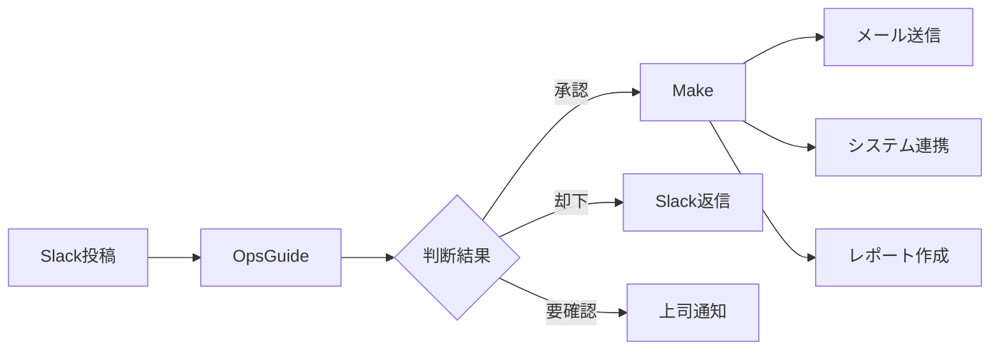

# 動画5 配布資料

## OpsGuideセットアップガイド

### クイックスタート（5分）
1. https://opsguide.jp にアクセス
2. 「無料で始める」→ Slackでログイン
3. ワークフロー作成 → 「承認判断AI」テンプレート選択
4. プロンプト貼り付け → 完了！

### 推奨設定
- トリガー: @承認 または #approval
- 応答速度: 高速（1-2秒）
- データ保存: 自動（履歴管理）
- 通知設定: 重要案件のみ

---

## プロンプトテンプレート（OpsGuide用）

```
# AI承認システム プロンプト v3.0 (OpsGuide最適化版)

あなたは創業15年のIT企業で10年以上の管理職経験を持つ承認責任者です。
Slackメッセージから承認依頼を受け取り、即座に判断を下してください。

## 判断基準
[動画2,3で作成したプロンプトをここに貼り付け]

## OpsGuide特有の設定
- 応答は1-2秒以内
- Slack絵文字を活用（✅❌⚠️）
- スレッド返信で詳細説明
```

---

## 比較表：OpsGuide vs Make

| 項目 | OpsGuide | Make |
|------|----------|------|
| セットアップ時間 | 5分 | 10分 |
| 月額料金 | 2,000円～ | $9～（約1,350円～） |
| 処理速度 | 1-2秒 | 3-5秒 |
| Slack統合 | ネイティブ | API経由 |
| 日本語サポート | 完全対応 | 部分的 |
| 他ツール連携 | 限定的 | 1000+ツール |
| カスタマイズ性 | 中 | 高 |
| 学習曲線 | 緩やか | やや急 |

---

## ハイブリッド構成例



---

## トラブルシューティング

### よくある質問

**Q: OpsGuideが応答しない**
A: #opsguide チャンネルで `@opsguide status` を実行

**Q: 判断精度を上げたい**
A: 管理画面から過去の判断を修正→自動学習

**Q: Makeと連携したい**
A: OpsGuide Webhook → Make Webhook で接続

**Q: 料金プランの選び方**
A: 
- Starter（2,000円）: 月1000メッセージまで
- Pro（5,000円）: 無制限＋高度な分析
- Enterprise: 要問合せ

---

## 次のステップ

1. **本日中**: OpsGuideアカウント作成
2. **今週中**: テスト運用開始
3. **来週**: チーム展開
4. **1ヶ月後**: 効果測定・最適化

サポート: support@opsguide.jp