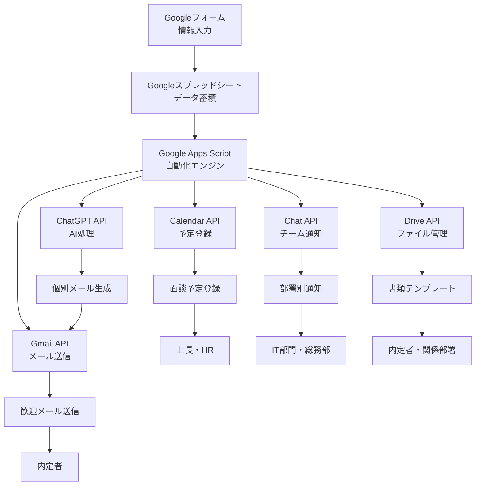

# 動画2: Google Workspace統合自動化フロー設計

## 🎯 学習目標

Google Workspace内での完全自動化フローの「設計図」を具体的に設計し、各Googleサービス間の連携方法とデータフローを理解する。

---

## 🏗️ 設計思想：Google統一アーキテクチャ

### **従来の問題点**
```
複雑な外部サービス連携
↓
Googleフォーム → Make → ChatGPT → Dify → Notion → Slack
↓
• 障害点が多い
• コスト高
• セキュリティリスク
• 管理複雑
```

### **改善後：Google完結型**
```
シンプルなGoogle統合
↓
Googleフォーム → GAS → Google APIs → 各種Googleサービス
↓
• 単一障害点
• 低コスト
• セキュア
• 統一管理
```

---

## 📊 完全自動化フロー設計図

### **全体アーキテクチャ**



### **データフロー詳細**

#### **1. 情報収集段階**
```
Step 1: Googleフォーム送信
├── 氏名
├── メールアドレス  
├── 入社日
├── 配属部署
├── 職種
└── 雇用形態

Step 2: スプレッドシート自動反映
├── タイムスタンプ追加
├── 一意ID生成
├── データ検証
└── 処理ステータス管理
```

#### **2. 自動化処理段階**
```
Step 3: GAS トリガー実行
├── onFormSubmit イベント検知
├── データ取得・構造化
├── バリデーション実行
└── 並行処理開始

Step 4: AI処理
├── ChatGPT API 呼び出し
├── 個別メール生成
├── タスクリスト作成
└── 案内文生成

Step 5: Google APIs 連携
├── Gmail: 歓迎メール送信
├── Calendar: 面談予定登録
├── Chat: 部署別通知
└── Drive: 書類準備
```

#### **3. 結果配信段階**
```
Step 6: 多方面同時配信
├── 内定者: 歓迎メール受信
├── 上長: カレンダー通知
├── IT部門: PC準備依頼
├── 総務部: 座席・備品準備
└── HR: プロセス完了報告
```

---

## ⚙️ 技術スタック詳細

### **コアエンジン：Google Apps Script**

#### **主要機能**
- **トリガー管理**: フォーム送信、時間ベース、編集時
- **API統合**: 全Googleサービス + 外部API
- **データ処理**: JavaScript による柔軟な処理
- **エラーハンドリング**: 堅牢な例外処理
- **ログ管理**: 詳細な実行ログ

#### **使用するGoogle APIs**
```javascript
// Gmail API - メール送信
Gmail.Users.Messages.send()

// Calendar API - 予定登録  
Calendar.Events.insert()

// Chat API - チーム通知
Chat.Spaces.Messages.create()

// Drive API - ファイル管理
Drive.Files.create()

// Sheets API - データ操作
Sheets.Spreadsheets.Values.update()
```

### **AI統合：ChatGPT API**

#### **活用箇所**
1. **個別歓迎メール生成**
   - 職種別カスタマイズ
   - 部署特有の情報追加
   - パーソナライズ

2. **タスクリスト生成**
   - 役職に応じた準備項目
   - 部署固有の要件
   - 期限設定

3. **案内文書生成**
   - 入社案内書類
   - 部署紹介資料
   - 研修スケジュール

---

## 🔧 実装設計

### **GASプロジェクト構成**

```
AI人事執事システム/
├── Code.gs                    # メインロジック
├── FormHandler.gs             # フォーム処理
├── EmailService.gs            # メール関連
├── CalendarService.gs         # カレンダー関連
├── ChatService.gs             # Chat通知関連
├── AIService.gs              # ChatGPT連携
├── ConfigService.gs          # 設定管理
└── UtilityService.gs         # 共通機能
```

### **設定管理**

#### **プロパティサービス活用**
```javascript
// APIキー・認証情報
PropertiesService.getScriptProperties().setProperties({
  'OPENAI_API_KEY': 'sk-xxx',
  'IT_CHAT_WEBHOOK': 'https://chat.googleapis.com/xxx',
  'GENERAL_AFFAIRS_WEBHOOK': 'https://chat.googleapis.com/yyy',
  'TASK_SHEET_ID': '1ABC...xyz',
  'CALENDAR_ID': 'company@example.com'
});
```

### **エラーハンドリング戦略**

#### **段階的フォールバック**
```javascript
function robustProcessing(employeeData) {
  try {
    // AIメール生成を試行
    const aiEmail = generateAIEmail(employeeData);
    return aiEmail;
  } catch (aiError) {
    console.log('AI生成失敗、テンプレートにフォールバック');
    // テンプレートメールにフォールバック
    return generateTemplateEmail(employeeData);
  }
}
```

---

## 📋 データモデル設計

### **スプレッドシート構造**

#### **内定者管理シート**
```
列A: タイムスタンプ
列B: 一意ID (自動生成)
列C: 氏名
列D: メールアドレス
列E: 入社日
列F: 配属部署
列G: 職種
列H: 雇用形態
列I: 処理ステータス
列J: 最終更新日時
列K: エラーログ
```

#### **タスク管理シート**
```
列A: 作成日時
列B: 内定者ID
列C: 内定者名
列D: タスク名
列E: 担当部署
列F: 期限
列G: ステータス
列H: 完了日時
列I: 備考
```

### **API連携データ形式**

#### **ChatGPT API ペイロード**
```json
{
  "model": "gpt-4",
  "messages": [
    {
      "role": "system",
      "content": "あなたは企業の人事担当者です。新入社員への心温まる歓迎メールを作成してください。"
    },
    {
      "role": "user", 
      "content": "氏名: 山田花子\n職種: システムエンジニア\n部署: 開発部\n入社日: 2024-04-01"
    }
  ],
  "max_tokens": 500,
  "temperature": 0.7
}
```

---

## 🔄 処理フロー詳細

### **メイン処理シーケンス**

```javascript
function onFormSubmit(e) {
  console.log('=== 自動化処理開始 ===');
  
  // 1. データ取得・検証
  const employeeData = extractAndValidateData(e);
  if (!employeeData.isValid) {
    logError('データ検証失敗', employeeData.errors);
    return;
  }
  
  // 2. 並行処理実行
  const promises = [
    generateAndSendEmail(employeeData),
    createCalendarEvents(employeeData), 
    sendDepartmentNotifications(employeeData),
    createTasks(employeeData)
  ];
  
  // 3. 結果集約
  try {
    const results = await Promise.allSettled(promises);
    logProcessingResults(employeeData, results);
  } catch (error) {
    handleProcessingError(employeeData, error);
  }
  
  console.log('=== 自動化処理完了 ===');
}
```

### **エラー復旧機能**

```javascript
function retryFailedProcessing() {
  const failedRecords = getFailedRecords();
  
  failedRecords.forEach(record => {
    console.log(`再処理実行: ${record.name}`);
    try {
      processEmployee(record);
      markAsSuccess(record.id);
    } catch (error) {
      incrementRetryCount(record.id);
      if (getRetryCount(record.id) >= 3) {
        markAsManualIntervention(record.id);
        notifyAdministrator(record, error);
      }
    }
  });
}
```

---

## 🎬 動画デモシナリオ

### **オープニング（0:00-1:30）**
- 前回の復習：「魔法」を体感した感想
- 今回のテーマ：「魔法の設計図」の重要性
- 建築の例：設計図なしで家は建てられない

### **設計思想の説明（1:30-3:00）**
- 従来の複雑な外部連携の問題
- Google統一環境の優位性
- セキュリティ・コスト・運用性の改善

### **ライブ設計デモ（3:00-7:00）**
1. **作図ツール（Miro/Lucidchart）を使用**
2. **リアルタイムで設計図作成**
   - Googleフォーム配置
   - スプレッドシート接続
   - GAS中央配置
   - 各API接続
   - データフロー線引き

3. **各コンポーネント説明**
   - 役割と責任
   - データの流れ
   - 処理タイミング

### **技術詳細解説（7:00-8:30）**
- GAS の中央ハブ機能
- 並行処理による高速化
- エラーハンドリング戦略
- 拡張性の考慮

### **まとめ・次回予告（8:30-10:00）**
- 設計図の重要性再確認
- 次回：実際の構築開始（Googleフォーム）
- 段階的実装アプローチ

---

## 📝 設計図テンプレート

### **図解要素**

#### **アイコン凡例**
- 🔴 データ入力ポイント
- 🟡 処理・変換ポイント  
- 🟢 出力・配信ポイント
- 🔵 外部API連携ポイント
- ⚪ 内部処理ポイント

#### **フロー線の種類**
- 実線：メインフロー
- 点線：条件分岐
- 二重線：並行処理
- 矢印：データの向き

### **設計チェックポイント**

- [ ] トリガーは明確に定義されているか
- [ ] データの流れに矛盾はないか
- [ ] エラー時の処理は考慮されているか
- [ ] 拡張性は確保されているか
- [ ] セキュリティは適切か
- [ ] パフォーマンスは十分か

---

## 🚀 期待される学習効果

### **設計スキル**
- システム全体俯瞰能力
- コンポーネント分割思考
- データフロー設計力

### **技術理解**
- Google APIs 連携概念
- 非同期処理の理解
- エラーハンドリング重要性

### **業務応用**
- 他業務への設計応用
- 段階的実装計画力
- リスク管理思考

---

この設計図により、受講者は「なぜそうなるのか」を理解し、自信を持って次の実装段階に進むことができます。